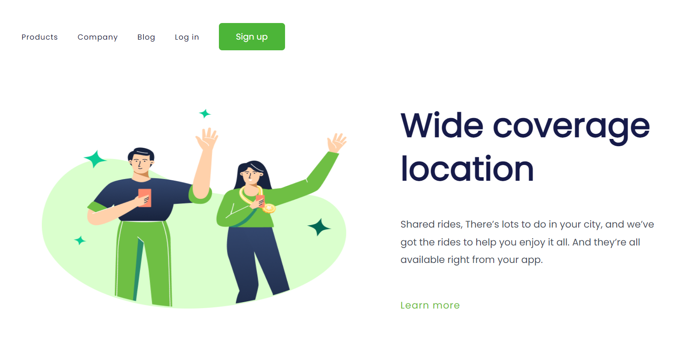
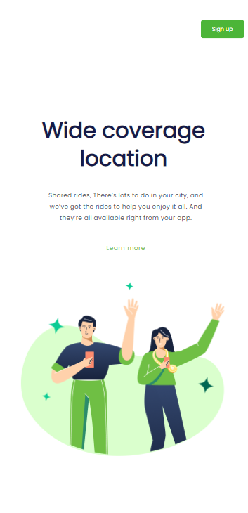

<h1> WIDE COVERAGE LOCATION </h1>
 

Um projeto fruto do acompanhamento das instruções no <a href="https://rodolfomori.com.br/devclub">DevClub</a> com ênfase na implementação de design responsivo e no aprimoramento do front-end.

 
<h2>Tecnologias Utilizadas:</h2>

- HTML
  
- CSS
  
 
<h1>Visualização Desktop:</h1>

 
<h1>Visualização Mobile:</h1>

